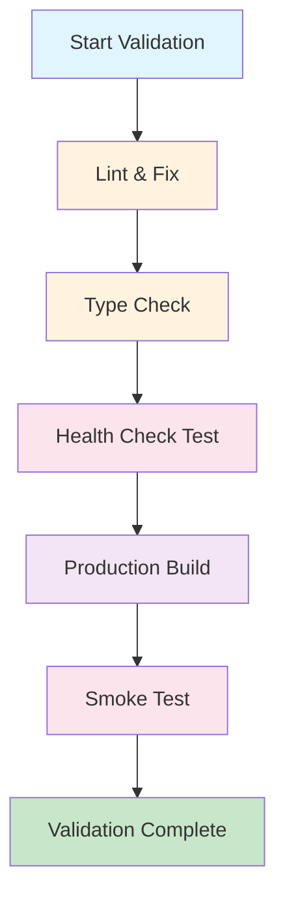

# Validation Sequence

Run this script and provide a report if it is not all green

```bash
pnpm validate
```

## Optimized Validation Sequence



## What is happening:

1. **[Lint & Fix](../../scripts/validate.sh)** - `pnpm lint --fix`
2. **[Type Check](../../scripts/validate.sh)** - `pnpm type-check`  
3. **[Health Check](../../tests/health-check.spec.ts)** - `pnpm health-check`
4. **[Production Build](../../scripts/validate.sh)** - `pnpm build`
5. **[Smoke Test](../../tests/smoke-test.spec.ts)** - `pnpm smoke-test`