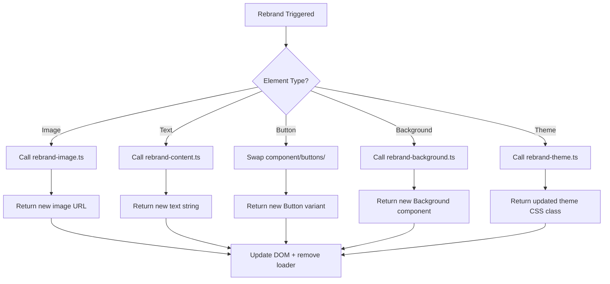

# Rebrand Orchestrator System

This is a single-page web app that allows users to trigger page-wide or individual component rebranding that affects all rebrandable components simultaneously. The system rebrands on-screen content using text from a predefined set of modern professional companies described in the content files.

## Features

### Page-wide Rebranding (FR-001)
- Users can trigger a page-wide rebrand that affects all rebrandable components simultaneously
- Page reloads and shows new styles and images

### Individual Component Rebranding (FR-002)
- Users can trigger a rebrand for individual components by clicking on them
- Displays new design that matches the current theme

### Image Rebranding (FR-003)
- Rebrands on-screen content such as logos when clicked
- Follows accessibility standards and includes a tooltip explaining what happens when clicking the element

### Content Rebranding (FR-004)
- Rebrands on-screen content using text from a predefined set of at least 5 modern professional companies described in the content files

### Loading States (FR-005)
- Shows starting content, as well as loading animations on all rebrandable components during the rebranding process

### Theme-coordinated Animations (FR-006)
- Applies random colors and animations to rebranded text from a set of predefined based on theme

## Architecture

### Core Components

1. **`<Rebrand />` Wrapper Component** - Atomic unit that wraps any HTML/React element to make it rebrandable
2. **`rebrand-orchestrator.ts`** - Decision engine that orchestrates the rebranding process
3. **Rebrand Modules** - Individual modules for handling different types of rebranding:
   - `rebrand-background.ts` - Background component swapping
   - `rebrand-theme.ts` - Theme selection and application
   - `rebrand-content.ts` - Text content generation
   - `rebrand-image.ts` - Image generation
   - `rebrand-text-design.ts` - Text component swapping
   - `rebrand-button.ts` - Button component swapping

### Decision Flow



## Technology Stack

- **Frontend**: Next.js v15.5.3, React v19.1.0, Tailwind CSS v4.1.13
- **UI Components**: Shadcn UI, Motion
- **AI Service**: Pollinations.AI API for image and text generation
- **State Management**: React Context

## File Structure

```
app/
├── content/
│   ├── companies.ts          # ≥5 professional company profiles
│   └── themes.ts            # theme → mood/feeling mapping
├── utils/
│   ├── rebrand-orchestrator.ts     # Main decision engine
│   ├── rebrand-theme.ts            # Theme swapper
│   ├── rebrand-content.ts          # Text rewriter
│   ├── rebrand-image.ts            # Image generator
│   ├── rebrand-background.ts       # Background swapper
│   └── pollinations-image.ts       # Pollinations API integration
├── components/
│   ├── ui/
│   │   ├── blur-fade.tsx           # For image loading
│   │   └── progress.tsx            # Generic loader
│   ├── buttons/                    # Rebrandable button variants
│   ├── backgrounds/                # Background components
│   ├── animate-ui/primitives/texts/ # Animated text components
│   └── animated-theme-toggler.tsx # Navbar theme switcher
└── global.css                      # 5 Shadcn themes defined here
```

## Functional Requirements

| ID       | Requirement                                                                                                                               | Status |
|----------|---------------------------------------------------------------------------|--------|
| FR-001   | Page-wide rebrand must reload all rebrandable components with new theme, images, and content.                                             | ✅ Done |
| FR-002   | Clicking individual `<Rebrand>` element must update only that element, matching current theme.                                            | ✅ Done |
| FR-003   | Rebranded images/logos must include tooltip ("Click to regenerate") and meet WCAG 2.1 contrast/accessibility standards.                  | ✅ Done |
| FR-004   | Content must pull from ≥5 companies in `companies.ts` — randomized per rebrand.                                                           | ✅ Done |
| FR-005   | Loading states MUST appear during rebrand (per element). MUST disappear only after Pollinations success signal.                           | ✅ Done |
| FR-006   | Text/button animations must derive from current theme's color palette. No random unrelated colors.                                        | ✅ Done |
| FR-007   | Layout must NEVER break across viewports (320px–4K). Verified via responsive testing.                                                     | ⏳ In Progress |
| FR-008   | All Pollinations API calls for images must use `processPollinationsPromptsSequentially()` to respect rate limits and await success.      | ✅ Done |
| FR-009   | Page must initialize with Professional Light/Dark theme. Theme toggle must persist via localStorage.                                      | ✅ Done |
| FR-010   | Orchestrator must emit events (`elementRebranded`, `themeChanged`) for animation sync.                                                    | ✅ Done |

## Installation

1. Clone the repository
2. Install dependencies: `pnpm install`
3. Run the development server: `pnpm run dev`

## Validation Sequence

1. `pnpm lint --fix` → Fix all ESLint + TypeScript errors
2. `pnpm run dev` → Verify no terminal or console errors
3. `curl -Is http://localhost:3000 | head -n 1` → Must return `HTTP/1.1 200 OK`
4. `next build` → Must complete without warnings or failures

## Contributing

This project follows strict guidelines for contributions:
- All rebrand logic must be isolated to the `app/` directory
- Only shadcn/ui and MagicUI components should be used for UI
- Theme and content randomization must use 5 predefined variants
- All AI-generated assets must be produced via the Pollinations API