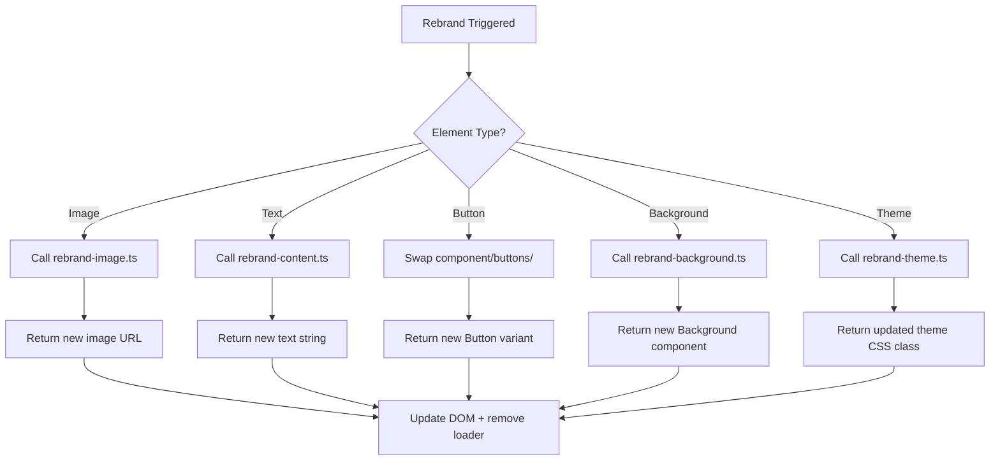

# Rebrand Orchestrator System

This is a single-page web app that allows users to trigger page-wide or individual component rebranding that affects all rebrandable components simultaneously. The system rebrands on-screen content using text from a predefined set of modern professional companies described in the content files.

## Architecture

### Core Components

1. **`<Rebrand />` Wrapper Component** - Atomic unit that wraps any HTML/React element to make it rebrandable
2. **`rebrand-orchestrator.ts`** - Decision engine that orchestrates the rebranding process
3. **Rebrand Modules** - Individual modules for handling different types of rebranding:
   - `rebrand-background.ts` - Background component swapping
   - `rebrand-theme.ts` - Theme selection and application
   - `rebrand-content.ts` - Text content generation
   - `rebrand-image.ts` - Image generation
   - `rebrand-text-design.ts` - Text component swapping
   - `rebrand-button.ts` - Button component swapping

### Decision Flow


```mermaid
graph TD
    A[Rebrand Triggered] --> B{Element Type?}
    B -->|Image| C[Call rebrand-image.ts]
    B -->|Text| D[Call rebrand-content.ts]
    B -->|Button| E[Swap component/buttons/]
    B -->|Background| F[Call rebrand-background.ts]
    B -->|Theme| G[Call rebrand-theme.ts]
    C --> H[Return new image URL]
    D --> I[Return new text string]
    E --> J[Return new Button variant]
    F --> K[Return new Background component]
    G --> L[Return updated theme CSS class]
    H --> M[Update DOM + remove loader]
    I --> M
    J --> M
    K --> M
    L --> M
```

## Technology Stack

- **Frontend**: Next.js v15.5.3, React v19.1.0, Tailwind CSS v4.1.13
- **UI Components**: Shadcn UI, Motion
- **AI Service**: Pollinations.AI API for image and text generation
- **State Management**: React Context

## File Structure

```
app/
├── content/
│   ├── companies.ts          # ≥5 professional company profiles
│   └── themes.ts            # theme → mood/feeling mapping
├── utils/
│   ├── rebrand-orchestrator.ts     # Main decision engine
│   ├── rebrand-theme.ts            # Theme swapper
│   ├── rebrand-content.ts          # Text rewriter
│   ├── rebrand-image.ts            # Image generator
│   ├── rebrand-background.ts       # Background swapper
│   └── pollinations-image.ts       # Pollinations API integration
├── components/
│   ├── ui/
│   │   ├── blur-fade.tsx           # For image loading
│   │   └── progress.tsx            # Generic loader
│   ├── buttons/                    # Rebrandable button variants
│   ├── backgrounds/                # Background components
│   ├── animate-ui/primitives/texts/ # Animated text components
│   └── animated-theme-toggler.tsx # Navbar theme switcher
└── global.css                      # 5 Shadcn themes defined here
```                                                | ✅ Done |

## Installation

1. Clone the repository
2. Install dependencies: `pnpm install`
3. Run the development server: `pnpm run dev`

## Validation Sequence

1. `pnpm lint --fix && pnpm build` 
2. Fix all ESLint + TypeScript Warning and Errors 
3. Fix all build issues

## Contributing

This project follows strict guidelines for contributions:
- All rebrand logic must be isolated to the `app/` or `components/rebrand` directory
- tailwindcss 4.1 and shadcn/ui for base components and style
- Theme and content randomization must use 5 predefined variants
- All AI-generated assets must be produced via the Pollinations API