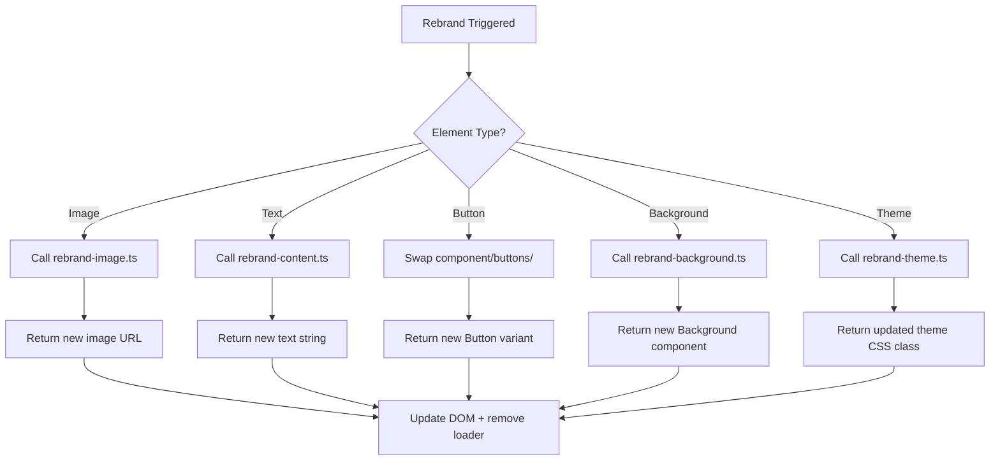

# System Architecture

## Core Components

### 1. `<Rebrand />` Wrapper Component
Atomic unit that wraps any HTML/React element to make it rebrandable. This component handles the orchestration of individual element rebranding.

### 2. Rebrand Orchestrator (`rebrand-orchestrator.ts`)
Decision engine that orchestrates the rebranding process. It determines what type of rebranding is needed (theme, content, image, etc.) and delegates to the appropriate modules.

### 3. Rebrand Modules
Individual modules for handling different types of rebranding:

- **`rebrand-background.ts`**: Background component swapping
- **`rebrand-theme.ts`**: Theme selection and application
- **`rebrand-content.ts`**: Text content generation
- **`rebrand-image.ts`**: Image generation
- **`rebrand-text-design.ts`**: Text component swapping
- **`rebrand-button.ts`**: Button component swapping

## Decision Flow



## Architecture Patterns

### Orchestrator Decision Flow
Requires specific sequence: theme → content → assets (deviates from typical component patterns)

### Sequential AI Processing
Uses `processPollinationsPromptsSequentially` to respect rate limits (hidden performance constraint)

### Theme-Content-Asset Coupling
Business profiles must match theme metadata for proper AI generation

## File Structure

```
app/
├── content/
│   ├── companies.ts          # ≥5 professional company profiles
│   └── themes.ts            # theme → mood/feeling mapping
├── utils/
│   ├── rebrand-orchestrator.ts     # Main decision engine
│   ├── rebrand-theme.ts            # Theme swapper
│   ├── rebrand-content.ts          # Text rewriter
│   ├── rebrand-image.ts            # Image generator
│   ├── rebrand-background.ts       # Background swapper
│   └── pollinations-image.ts       # Pollinations API integration
├── components/
│   ├── ui/
│   │   ├── blur-fade.tsx           # For image loading
│   │   └── progress.tsx            # Generic loader
│   ├── buttons/                    # Rebrandable button variants
│   ├── backgrounds/                # Background components
│   ├── animate-ui/primitives/texts/ # Animated text components
│   └── animated-theme-toggler.tsx # Navbar theme switcher
└── global.css                      # 5 Shadcn themes defined here
```

## Critical Paths

1. **Page-wide Rebranding**: Orchestrator coordinates theme, content, and asset rebranding across all components
2. **Individual Component Rebranding**: Direct component-level rebranding with theme coordination
3. **AI Content Generation**: Sequential processing of Pollinations API calls with rate limit respect
4. **Theme Switching**: Dynamic CSS variable updates with localStorage persistence
5. **Loading State Management**: Coordinated loading animations with success/failure handling