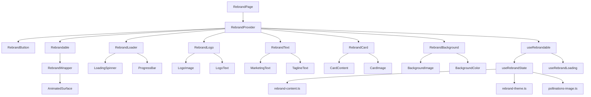
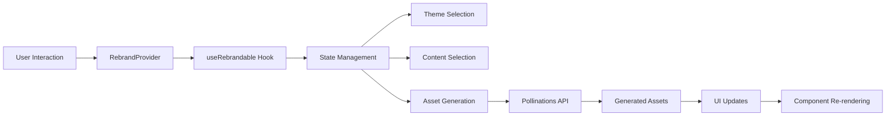

# Rebrand Feature Architecture Plan

## Overview

This document outlines the architectural plan for the rebrand feature, detailing the component hierarchy, data flow, and implementation approach. The goal is to create a maintainable, modular system that allows for page-wide and component-level rebranding with AI-generated assets.

## File Structure

```
app/
├── components/
│   ├── rebrand/
│   │   ├── rebrand-provider.tsx
│   │   ├── rebrandable.tsx
│   │   ├── rebrand-button.tsx
│   │   ├── rebrand-loader.tsx
│   │   ├── rebrand-logo.tsx
│   │   ├── rebrand-text.tsx
│   │   ├── rebrand-card.tsx
│   │   ├── rebrand-background.tsx
│   │   ├── rebrand-wrapper.tsx
│   │   ├── rebrand-animations.ts
│   │   └── rebrand-page.tsx
├── hooks/
│   ├── use-rebrandable.ts
│   ├── use-rebrand-state.ts
│   └── use-rebrand-loading.ts
├── utils/
│   ├── pollinations-image.ts
│   └── rebrand-content.ts
└── themes/
    ├── rebrand-theme.ts
    ├── theme-1.ts
    ├── theme-2.ts
    ├── theme-3.ts
    ├── theme-4.ts
    └── theme-5.ts
```

## Component Hierarchy (kabob-casing for filenames and directories)



## Data Flow



## Implementation Plan

### Phase 1: Core Infrastructure

1. **Rebrand Provider Component**
   - [ ] Create `rebrand-provider.tsx` to manage global rebrand state
   - [ ] Implement context for sharing rebrand state across components
   - [ ] Connect to existing `use-rebrandable` hook

2. **Rebrandable Wrapper Component**
   - [ ] Create `rebrandable.tsx` to wrap rebrandable elements
   - [ ] Implement MagicUI animated borders and loading states
   - [ ] Add click handlers for local rebranding

3. **State Management**
   - [ ] Enhance `use-rebrandable` hook with proper state management
   - [ ] Implement theme and content selection logic
   - [ ] Add loading state coordination

### Phase 2: UI Components

1. **Rebrand Button**
   - [ ] Create `rebrand-button.tsx` using shadcn/ui components
   - [ ] Implement global and local rebrand triggers
   - [ ] Add loading states and visual feedback

2. **Rebrand Loader**
   - [ ] Create `rebrand-loader.tsx` for loading animations
   - [ ] Implement progress indicators and spinners
   - [ ] Add customizable loading messages

3. **Rebrand Logo**
   - [ ] Create `rebrand-logo.tsx` for logo components
   - [ ] Implement logo randomization functionality
   - [ ] Add click handlers for local rebranding

4. **Rebrand Text**
   - [ ] Create `rebrand-text.tsx` for marketing text
   - [ ] Implement text randomization from YAML content
   - [ ] Add animated text effects

5. **Rebrand Card**
   - [ ] Create `rebrand-card.tsx` for feature cards
   - [ ] Implement card rebranding functionality
   - [ ] Add hover and click effects

6. **Rebrand Background**
   - [ ] Create `rebrand-background.tsx` for background elements
   - [ ] Implement background image generation
   - [ ] Add transition effects between themes

### Phase 3: Utilities and Services

1. **Pollinations Image Service**
   - [ ] Enhance `pollinations-image.ts` with sequential API calls
   - [ ] Implement loading state management
   - [ ] Add error handling and fallbacks

2. **Content Loader**
   - [ ] Enhance `rebrand-content.ts` with marketing text randomization
   - [ ] Implement business profile selection
   - [ ] Add content caching

3. **Theme Engine**
   - [ ] Enhance `rebrand-theme.ts` with theme randomization
   - [ ] Implement color and animation application
   - [ ] Add theme persistence

### Phase 4: Integration and Testing

1. **Component Integration**
   - [ ] Connect all components to the RebrandProvider
   - [ ] Implement data flow between components
   - [ ] Add event handling and state updates

2. **UI Polish**
   - [ ] Add smooth transitions and animations
   - [ ] Implement responsive design
   - [ ] Add accessibility features

3. **Testing and Validation**
   - [ ] Test all rebrand functionality
   - [ ] Validate state management
   - [ ] Check loading states and error handling


## State Management

The rebrand feature uses a combination of React Context and custom hooks for state management:

1. **Global State** - Managed by `RebrandProvider` and `useRebrandable` hook
2. **Component State** - Managed by individual components or `useRebrandState` hook
3. **Loading State** - Managed by `useRebrandLoading` hook

## API Integration

The rebrand feature integrates with the Pollinations API for asset generation:

1. **Sequential Calls** - API calls are made sequentially to avoid overwhelming the service
2. **Loading States** - Each asset has its own loading state
3. **Error Handling** - Proper error handling with fallbacks for failed asset generation

## Performance Considerations

1. **Memoization** - Use `React.memo` and `useMemo` to optimize re-renders
2. **Lazy Loading** - Implement lazy loading for non-critical components
3. **Caching** - Cache generated assets to avoid redundant API calls
4. **Bundle Size** - Optimize bundle size by code splitting where appropriate

## Accessibility

1. **Keyboard Navigation** - Ensure all interactive elements are keyboard accessible
2. **Screen Readers** - Add proper ARIA labels and roles
3. **Focus Management** - Implement proper focus management during rebranding
4. **Color Contrast** - Ensure sufficient color contrast for all text elements

## Testing Strategy

1. **Playwright** - Test valid urls,  
2. **Accessibility Tests** - Validate accessibility compliance

## Deployment Considerations

1. **Environment Variables** - Use environment variables for API keys and configuration
2. **Error Boundaries** - Implement error boundaries to handle runtime errors
3. **Monitoring** - Add monitoring for API usage and performance metrics
4. **Rollback Strategy** - Implement a rollback strategy for failed deployments

## Implementation Status

✅ **Implementation Complete**

All components and features have been implemented according to the architecture plan:

- RebrandProvider for global state management using React Context
- Rebrandable wrapper for individual component rebranding
- RebrandButton with shadcn/ui integration and loading states
- RebrandLoader with animated loading indicators
- RebrandLogo with image fallback functionality
- RebrandText for dynamic marketing content
- RebrandCard for feature displays with image generation
- RebrandBackground for page-level styling
- RebrandWrapper for themed containers
- Sequential API call handling in pollinations-image.ts
- Enhanced content randomization in rebrand-content.ts
- Extended theme options in rebrand-theme.ts
- Smooth animations and transitions using Framer Motion
- Comprehensive accessibility features