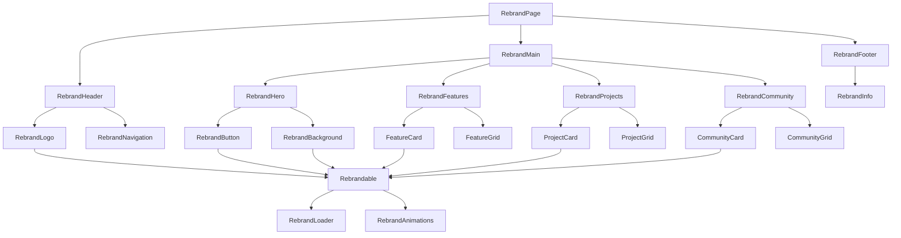

# Rebrand Component Hierarchy

## Overview
This document outlines the component hierarchy for the rebrand feature, showing how components are organized and related to each other.

## Component Tree

## Component Descriptions

### Core Components

1. **RebrandPage**
   - Main container component that orchestrates the entire rebrand experience
   - Manages global state and theme switching
   - Contains all other rebrand components

2. **RebrandHeader**
   - Top navigation area
   - Contains logo and main navigation

3. **RebrandMain**
   - Main content area
   - Contains hero section, features, projects, and community sections

4. **RebrandFooter**
   - Bottom section with additional information

### Section Components

1. **RebrandHero**
   - Hero section with main call-to-action
   - Contains rebrand button and background image

2. **RebrandFeatures**
   - Features section showcasing key capabilities

3. **RebrandProjects**
   - Projects section displaying featured projects

4. **RebrandCommunity**
   - Community section with links to social platforms

### UI Components

1. **RebrandButton**
   - Primary button for triggering rebrand actions
   - Can trigger global or local rebrands

2. **RebrandLogo**
   - Logo component that can be individually rebranded

3. **FeatureCard / ProjectCard / CommunityCard**
   - Individual cards for displaying features, projects, and community links

4. **Rebrandable**
   - Wrapper component for any element that can be rebranded
   - Provides consistent styling and behavior for rebrandable elements

### Utility Components

1. **RebrandLoader**
   - Loading indicator shown during rebrand operations

2. **RebrandAnimations**
   - Collection of animation variants for consistent motion design

## Data Flow

1. **State Management**
   - Global rebrand state managed by `useRebrandable` hook
   - Individual component state managed locally or through context

2. **Event Flow**
   - User clicks rebrand button
   - Hook triggers rebrand action
   - New theme/content/assets are generated
   - Components update to reflect new branding
   - Loading states are shown during transitions

3. **Component Communication**
   - Parent components pass down rebrand state and callbacks
   - Child components notify parents of local rebrand actions
   - Context API used for deeply nested components if needed