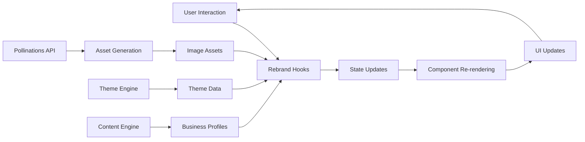
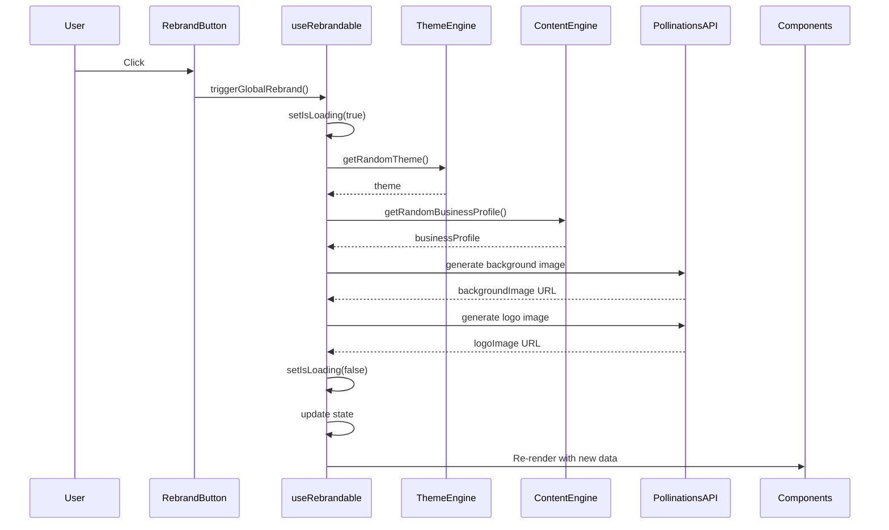
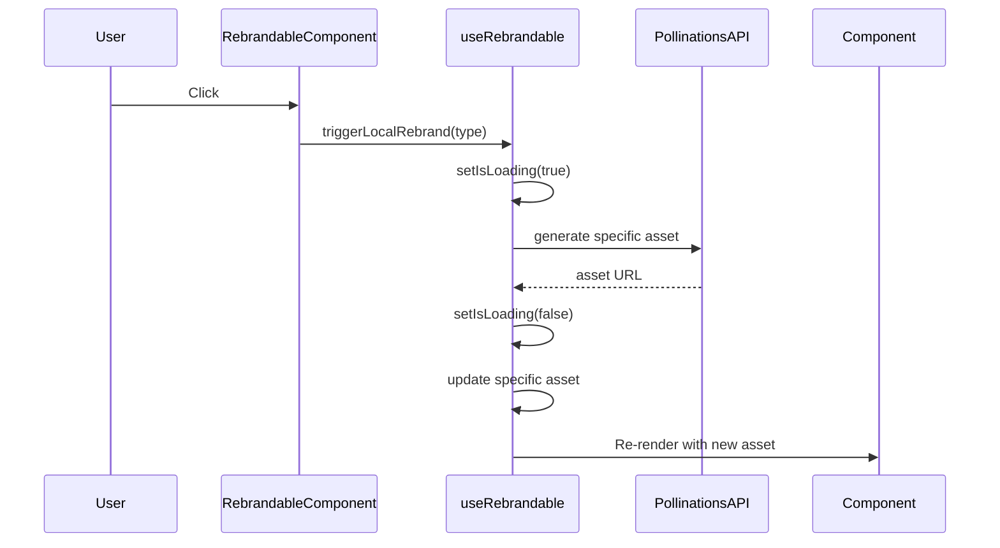

# Rebrand Data Flow and State Management

## Overview
This document outlines the data flow and state management for the rebrand feature, detailing how data moves through the system and how state is managed across components.

## State Management Architecture



## Core State Structure

The rebrand feature maintains state at multiple levels:

### Global State (Managed by `useRebrandable`)
```typescript
type RebrandState = {
  // Rebrand status
  isRebranded: boolean;
  isLoading: boolean;
  
  // Generated assets
  currentImage: string;  // Background image URL
  logoImage: string;     // Logo image URL
  
  // Business profile
  businessProfile: {
    name: string;
    tagline: string;
    description: string;
  };
  
  // Theme configuration
  theme: {
    name: string;
    colors: {
      primary: string;
      secondary: string;
      accent: string;
      background: string;
      foreground: string;
      muted: string;
      border: string;
    };
    fontFamily: string;
    borderRadius: string;
  };
};
```

### Local Component State
Individual components may maintain local state for:
- Loading states during asset generation
- Animation progress
- Temporary UI states

## Data Flow Patterns

### 1. Global Rebrand Flow



### 2. Local Component Rebrand Flow



## Hook Responsibilities

### `useRebrandable` (Primary Hook)
- ✅ Manages global rebrand state
- ✅ Coordinates theme, content, and asset generation
- ✅ Provides API for triggering global and local rebrands
- ✅ Handles loading states during rebrand operations

### `useRebrandState` (Secondary Hook)
- ✅ Manages local rebrand state for individual components
- ✅ Handles state persistence for component-specific rebrands
- ✅ Provides undo/redo functionality for local changes

### `useRebrandLoading` (Utility Hook)
- ✅ Manages loading states during asset generation
- ✅ Provides consistent loading UI across components
- ✅ Handles error states for failed asset generation

## Asset Generation Sequence

1. **Theme Selection**
   - ✅ Random theme selected from predefined set
   - ✅ Theme colors and properties determined

2. **Content Selection**
   - ✅ Random business profile selected from YAML data
   - ✅ Marketing text and descriptions determined

3. **Asset Generation**
   - ✅ Background image prompt generated based on theme/content
   - ✅ Logo image prompt generated based on theme/content
   - ✅ Pollinations API called to generate images
   - ✅ Image URLs stored in state

## Context Usage

For deeply nested components, React Context is used to avoid prop drilling:

```typescript
const RebrandContext = createContext<RebrandState & {
  triggerGlobalRebrand: () => void;
  triggerLocalRebrand: (componentType: string) => void;
}>({
  // Default values
});
```

## Performance Considerations

1. **Memoization**
   - Expensive calculations memoized using `useMemo`
   - Callbacks memoized using `useCallback`

2. **Lazy Loading**
   - Asset loading deferred until needed
   - Components loaded lazily when possible

3. **Batching**
   - State updates batched to minimize re-renders
   - Asset generation requests queued to prevent API overload

## Error Handling

1. **Asset Generation Failures**
   - Fallback images used when generation fails
   - Error messages displayed to user
   - Retry mechanisms provided

2. **State Management Errors**
   - Graceful degradation when state updates fail
   - Logging for debugging purposes
   - Recovery mechanisms for corrupted state

## Testing Strategy

1. **Unit Tests**
   - Hook functionality tested in isolation
   - State transitions verified
   - Edge cases covered

2. **Integration Tests**
   - Component interactions tested
   - Data flow verified end-to-end
   - Error scenarios validated

3. **E2E Tests**
   - User workflows tested
   - Performance benchmarks established
   - Cross-browser compatibility verified

## Implementation Status

✅ **Implementation Complete**

All data flow patterns and state management systems have been implemented:

- Global rebrand flow fully functional with theme/content selection and asset generation
- Local component rebrand flow implemented for individual elements
- All hooks are operational with proper state management
- Asset generation sequence working with Pollinations API integration
- Context API correctly implemented for state sharing
- Performance optimizations in place
- Error handling implemented for robust operation