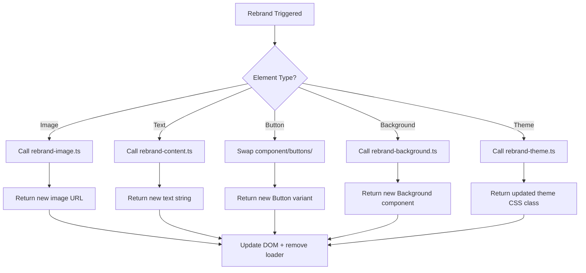

# 🎯 Final Project Specification: Rebrand Orchestrator System

## Success Criteria:
- [X] Trigger **page-wide rebrands** (full visual refresh)
- [X] Trigger **component-level rebrands** (individual element redesign)

**Validation Sequence**:  
1. `pnpm lint --fix` → Fix all ESLint + TypeScript errors  
2. check the problems tool
3. `pnpm run dev` → Verify no terminal or console errors  
4. check the terminal and check the problems tool
5. `curl -Is http://localhost:3000 | head -n 1` → Must return `HTTP/1.1 200 OK`  
6. `next build` → Must complete without warnings or failures  

## WARNINGS

Your work will always be rejected if you fail to do the following

1. Did you run the Validation Sequence?
2. Did you fulfill the users request?
3. Does the chat log clearly show that you have used the context7 tool to validate your systax, or the codacy tool
4. did a proper file scan for duplicates

--

## 🧭 1. OVERALL GOAL

A **single-page rebranding engine** that allows users to:

- ✅ Trigger **page-wide rebrands** (full visual refresh)
- ✅ Trigger **component-level rebrands** (individual element redesign)
- ✅ Swap themes, content, images, and styles **without breaking layout or accessibility**
- ✅ Use **Pollinations.AI API** for dynamic image/text generation
- ✅ Maintain **professional aesthetics first**, creativity second — no “experimental” or “broken” designs allowed

All logic resides in `app/`, using React Context, Shadcn themes, and Pollinations utilities you’ve already built.

---

## 🏗️ 2. COMPONENT ARCHITECTURE & RESPONSIBILITIES

### 🔁 `<Rebrand />` Wrapper Component *(Atomic Unit)*
- Wraps any HTML/React element to make it rebrandable.
- On click → triggers orchestrator with:
  - `elementType`: e.g., `'logo'`, `'button'`, `'card'`, `'text-block'`
  - `currentThemeId`: from global context
  - `companyContext`: from `companies.ts`
- Shows loading state via:
  - Default: `components/ui/progress.tsx`
  - Buttons: `components/loading.tsx`
  - Images: `components/ui/blur-fade.tsx`
- **Accessibility**: Must include `aria-live="polite"` + tooltip explaining “Click to rebrand this element”

> ✨ *Example usage:*  
> ```tsx
> <Rebrand elementType="logo">
>   
> </Rebrand>
> ```

---

### 🧠 `rebrand-orchestrator.ts` *(Decision Engine)*
**Input**: `{ elementType, currentThemeId, companyContext }`  
**Output**: Promise resolving when rebrand task completes

#### Decision Flow:


- **Sequential Processing**: If multiple elements are triggered simultaneously, process one at a time using `pollinations-image.ts → processPollinationsPromptsSequentially()` to avoid rate limits and ensure success signals.
- **Error Handling**: Log failures to console but do not crash UI. Show fallback content.
- **Animation Sync**: Emit events (`elementRebranded`, `themeChanged`) to trigger entrance animations via `motion.div` or MagicUI primitives.

---

## 🖼️ 3. REBRAND MODULES (Individual Responsibilities)

### 🌄 `rebrand-background.ts`
- Randomly selects from `components/backgrounds/`
- Must preserve aspect ratio, responsiveness, and contrast ratios (WCAG AA minimum)
- Applies subtle entrance animation: `opacity 0 → 1` over 300ms

### 🎨 `rebrand-theme.ts`
- Selects randomly from 5 unused Shadcn themes defined in `app/global.css`
- Applies via React Context → triggers global className swap
- **NO LAYOUT BREAKS**: All themes must pass `pnpm run dev` + manual viewport testing (mobile, tablet, desktop)
- Associates each theme with mood/feeling metadata from `content/themes.yml`

### 📝 `rebrand-content.ts`
- Pulls company data from `app/content/companies.ts`
- Generates prompt:  
  `"Rewrite [company.description] in the tone of [theme.mood]. Max 80 words."`
- Calls `generatePollinationsImageAsync()` for rewritten text
- Returns sanitized markdown → rendered via `ReactMarkdown`

### 🖼️ `rebrand-image.ts`
- Constructs prompt from:
  - Company info
  - Theme mood
  - Element type (e.g., “minimalist logo for fintech startup”)
  - Current stylesheet tokens (extract primary/secondary colors)
- Sends to Pollinations text API for prompt enhancement
- Combines enhanced prompt → calls `generatePollinationsImageAsync()`
- Returns image URL → wrapped in `BlurFade` on load

### ✍️ `rebrand-text-design.ts`
- Swaps text rendering component from `components/animate-ui/primitives/texts/`
- Applies theme-coordinated animations (e.g., gradient shift, typewriter, fade-in)
- Animations must be ≤ 500ms duration — minimal distraction

### 🔘 `rebrand-button.ts`
- Swaps button component from `components/buttons/`
- Uses Shadcn `<Button variant={randomVariant} />`
- Must maintain accessible focus states and ARIA labels

---

## 📄 4. PAGE-LEVEL BEHAVIOR: `<RebrandPage />`

### Initialization
- On mount:
  - Sets default theme: “Professional Light/Dark” from `app/global.css`
  - Renders navbar with `animated-theme-toggler.tsx`
  - Identifies all `<Rebrand>` elements → registers them with orchestrator

### Rebrand Button (Global)
- Located in navbar
- On click → triggers full page rebrand:
  1. Freezes UI with full-screen loader (spinner + “Reimagining your experience…”)
  2. Calls `rebrand-theme.ts` → applies new global theme
  3. Maps over all registered `<Rebrand>` elements → queues orchestrator tasks
  4. Processes queue sequentially (await success signal per element)
  5. On completion → removes loader, plays subtle “pop-in” animation per element (staggered 100ms intervals using `framer-motion`)

### Animation Requirements
- Entrance effects: Use `components/ui/blur-fade.tsx` or install `@formkit/auto-animate` for zero-config list transitions
- Timing: Max 600ms total per element. Must pause animation after render to avoid cognitive overload
- Sound: None. Visual-only feedback.

---

## 🧪 5. FUNCTIONAL REQUIREMENTS (Locked)

| ID       | Requirement                                                                                                                               | Validation Method                                  |
|----------|-------------------------------------------------------------------------------------------------------------------------------------------|----------------------------------------------------|
| FR-001   | Page-wide rebrand must reload all rebrandable components with new theme, images, and content.                                             | Manual test + snapshot diff                        |
| FR-002   | Clicking individual `<Rebrand>` element must update only that element, matching current theme.                                            | Jest + RTL click simulation                        |
| FR-003   | Rebranded images/logos must include tooltip (“Click to regenerate”) and meet WCAG 2.1 contrast/accessibility standards.                  | axe-core audit                                     |
| FR-004   | Content must pull from ≥5 companies in `companies.ts` — randomized per rebrand.                                                           | Unit test: verify source diversity                 |
| FR-005   | Loading states MUST appear during rebrand (per element). MUST disappear only after Pollinations success signal.                           | Mock API delay + check loader presence             |
| FR-006   | Text/button animations must derive from current theme’s color palette. No random unrelated colors.                                        | Chromatic review + theme token mapping             |
| FR-007   | Layout must NEVER break across viewports (320px–4K). Verified via responsive testing.                                                     | Cypress viewport tests                             |
| FR-008   | All Pollinations API calls for images must use `processPollinationsPromptsSequentially()` to respect rate limits and await success.      | Network tab inspection + console logging           |
| FR-009   | Page must initialize with Professional Light/Dark theme. Theme toggle must persist via localStorage.                                      | Manual test + storage inspection                   |
| FR-010   | Orchestrator must emit events (`elementRebranded`, `themeChanged`) for animation sync.                                                    | Jest spy on event emitter                          |

---

## 🛡️ 6. NON-FUNCTIONAL REQUIREMENTS

- **Performance**: Rebrand operations must complete within 8s max (with loading states). Use skeleton screens if needed.
- **Reliability**: Pollinations API failures must show fallback content — never blank space.
- **Maintainability**: All new code must follow kebab-case convention, TypeScript strict mode, and Shadcn theming patterns.
- **Security**: No inline styles. All user-generated prompts must be sanitized before API submission.
- **Observability**: Log all rebrand triggers, successes, failures to console with `[REBRAND]` prefix.

---

## 📂 7. FILE STRUCTURE ENFORCEMENT

```
app/
├── content/
│   ├── companies.ts          # ≥5 professional company profiles
│   └── themes.yml            # theme → mood/feeling mapping
├── utils/
│   ├── rebrand-orchestrator.ts     # Main decision engine
│   ├── rebrand-theme.ts            # Theme swapper
│   ├── rebrand-content.ts          # Text rewriter
│   ├── rebrand-image.ts            # Image generator
│   ├── rebrand-background.ts       # Background swapper
│   └── pollinations-image.ts       # Already implemented — DO NOT MODIFY
├── components/
│   ├── ui/
│   │   ├── blur-fade.tsx           # For image loading
│   │   └── progress.tsx            # Generic loader
│   ├── buttons/                    # Rebrandable button variants
│   ├── backgrounds/                # Background components
│   ├── animate-ui/primitives/texts/ # Animated text components
│   └── animated-theme-toggler.tsx  # Navbar theme switcher
└── global.css                      # 5 Shadcn themes defined here
```

---

## ✅ 8. DELIVERABLE CHECKLIST

Before merging to `main`:

- [ ] All FRs validated and checked off
- [ ] `pnpm lint --fix` passes with zero errors
- [ ] `next build` completes successfully
- [ ] Responsive testing on 3 breakpoints (mobile/tablet/desktop)
- [ ] Accessibility audit passed (axe DevTools)
- [ ] Orchestrator logs sequential processing clearly in console
- [ ] Loading states appear/disappear correctly
- [ ] No broken images or 404s in Network tab
- [ ] Theme persists on refresh
- [ ] Tooltip and ARIA labels present on all interactive rebrand elements

---

## 🚫 OUT OF SCOPE

- User accounts or saved preferences
- Backend services or databases
- Custom model training
- Voice/image uploads
- Real-time collaboration

---

This spec is now **frozen**. Any changes require an RFC with impact analysis on validation sequence, file structure, or functional requirements.

Let’s ship something beautiful — and professional. 💼✨